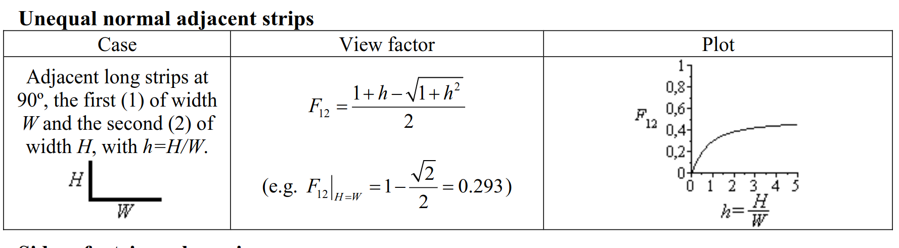
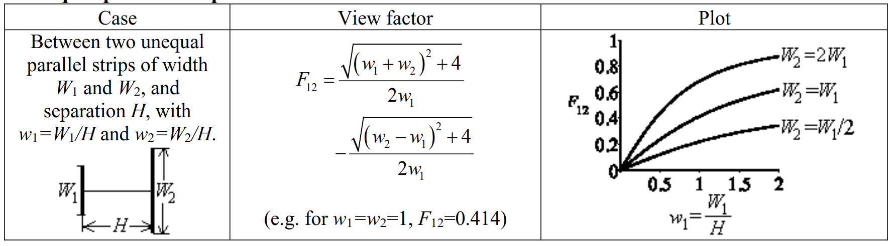

# view-factor
View factor simulations in Rust

## What is a view factor?
A view factor is a portion of radiative heat flux which leaves a given surface, and "hits" another.  The view factor is based completely on the geometry, and is independent of physical surface properties or temperature.  It is a direct scaling factor on the amount of heat transfer between two surfaces via radiation.

Traditionally, the amount of heat transfer between two surfaces (i, and j) is given by:

$$
Q_{ij}=A_i\epsilon_iF_{ij}\sigma(T_i^4 - T_j^4)
$$

Where $F_{ij}$ is the view factor between the two surfaces and $0 \le F_{ij} \le 1.0$.

## Some rules surrounding view factors
If you have a fully-enclosed environment, the view factors from surface $i$ in that enclosure to all surfaces of the enclosure $j$ must equal unity (conservation of energy):

$$
\sum_{j=1}^n F_{ij} = 1
$$

Also, if the area of surface $j$ is equal to the area of surface $i$, then there is a rule of reciprocity that states:

$$
F_{ij} = F_{ji}
$$

## Determining view factors
For simple geometries, there are some analytical solutions available--however, more complex geometries must be solved for numerically.  The purpose of this project is to allow the user to specify a number of shapes in 2D, and then numerically determine all view factors.

### Analytic Solutions
There are analytic solutions available for common configurations--a few are shown below, and will be utilized to verify the accuracy of the simulation:

#### Unequal adjacent strips

#### Parallel strips

### Numeric Solutions
In order to solve for each view factor, we can use a monte carlo simulation and take:
1. A random position on surface $i$
2. Project an emissive ray at a random angle from surface $i$ to surface $j$ ($j$ could equal $i$ ultimately)
3. Determine if the ray "hits" 
4. Repeat steps 1-3 $N$ times, and calculate the percent of "hits" vs. "misses" -- this result is the view factor.

There are some additional constraints that aren't mentioned in these steps--for example, physically an emissive ray wouldn't emit back into itself, so additional considerations need to be taken for what is a valid range of angles to project the ray from.  

As the project progresses, the full solution approach will be documented.

## How to use this project
TBD - currently quite a bit is hard-coded, and I am still coming up to speed on using Rust--so with these two factors combined the code is quite messy.  However, you should be able to simply run `cargo run` and it should run as expected with the default parameters and geometry.